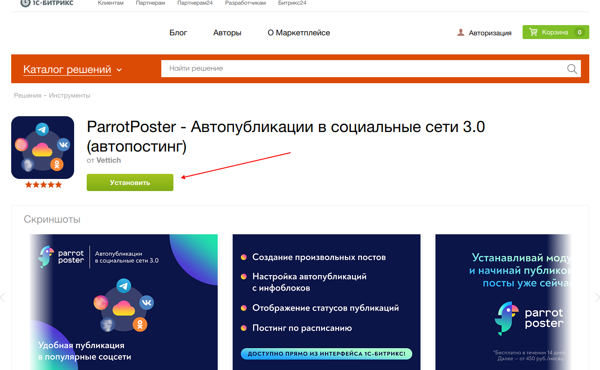
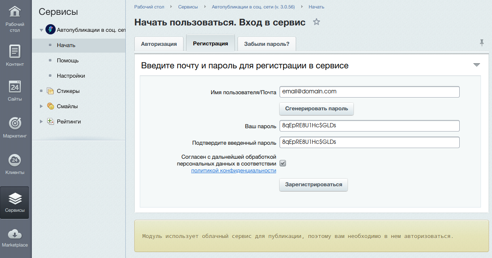
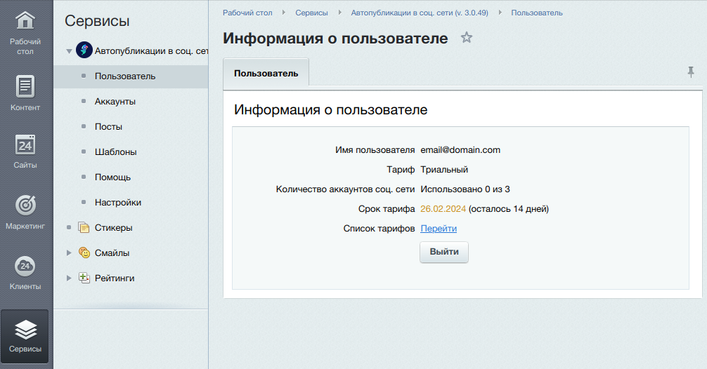
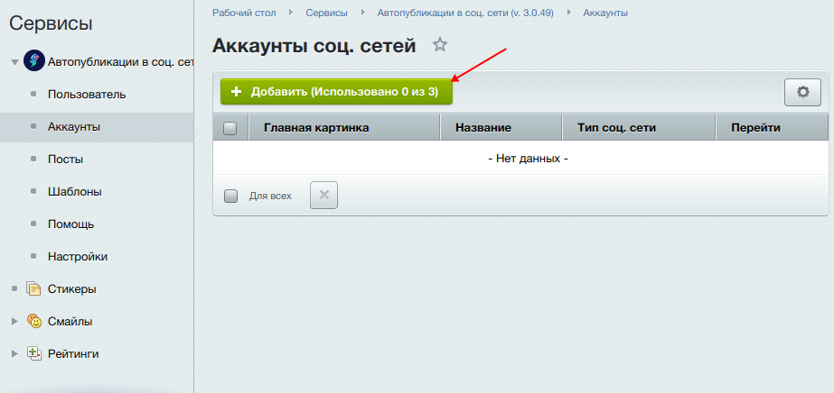
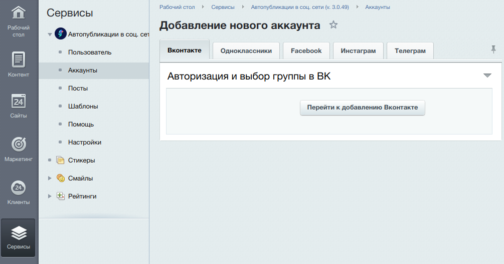

# Модуль ParrotPoster для 1С-Битрикс

Модуль позволяет интегрировать сервис автопубликаций ParrotPoster и ваш сайт на CMS 1С-Битрикс. Какие преимущества это дает?

- Легко делиться: вы пишите новость на сайте, а модуль автоматически опубликует эту новость во всех соцсетях
- Удобно пользоваться: управление всем процессом публикации происходит через модуль

## Установка

Чтобы установить модуль на ваш сайт, перейдите в [маркетплейс 1С-Битрикс](https://marketplace.1c-bitrix.ru/solutions/vettich.sp3/) и нажмите на кнопку "Установить".
Процесс установки является стандартным для системы 1С-Битрикс.

После установки, необходимо авторизоваться или зарегистрироваться в модуле. Это необходимо, т.к. модуль работает на базе облачного сервиса [ParrotPoster](https://parrotposter.com).

После регистрации у вас будет 14 дней, чтобы протестировать модуль.
Затем необходимо будет перейти на платный тариф.
Узнать подробнее про тарифы и оплату можно на сайте [ParrotPoster](https://parrotposter.com).

::: tip Обратите внимание
Если во время использования возникнут какие-либо вопросы, смело обращайтесь к нам на почту [support@parrotposter.com](mailto:support@parrotposter.com), мы постараемся помочь!
:::

Следующим шагом необходимо подключить нужные аккаунты соцсетей

## Подключение аккаунтов

Для подключение нового аккаунта, перейдите на страницу "Аккаунты"

После регистрации, у вас будет пустой список аккаунтов.
Нажмите на кнопку добавить, чтобы подключить нужную соцсеть.

В скобках кнопки Добавить указана информация из тарифного плана: сколько аккаунтов было подключено и сколько доступно всего.

Процесс подключение соцсети максимально упрощен, так что вам необходимо будет нажать на кнопку Перейти к добавлению, и выбрать нужную группу/страницу соцсети.

Тем не менее, чтобы узнать подробнее про подключение соцсетей, перейдите к интересующей вас странице документации:

- [ВК](./socials/vk/)
- [Telegram](./socials/tg/)
- [Facebook](./socials/fb/)
- [Instagram](./socials/insta/)
- [Одноклассники](./socials/ok/)

