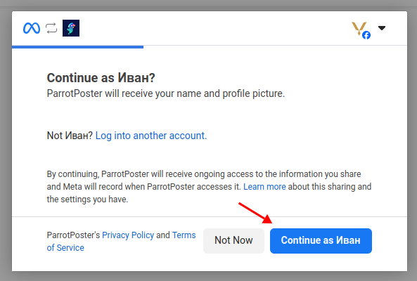
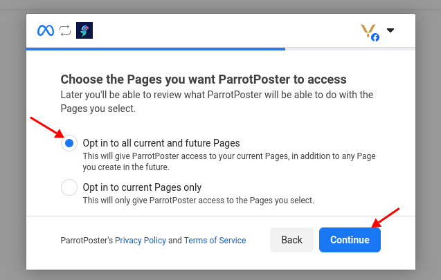
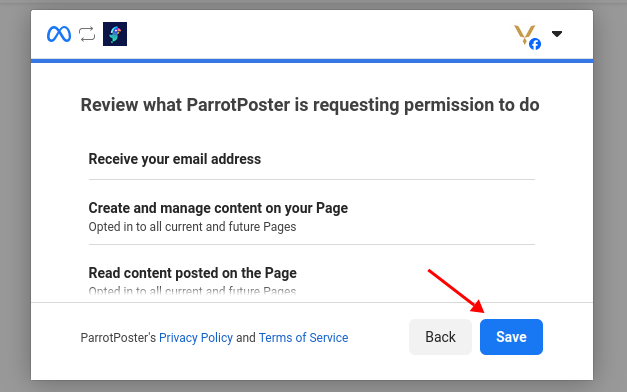
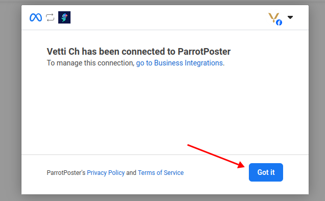
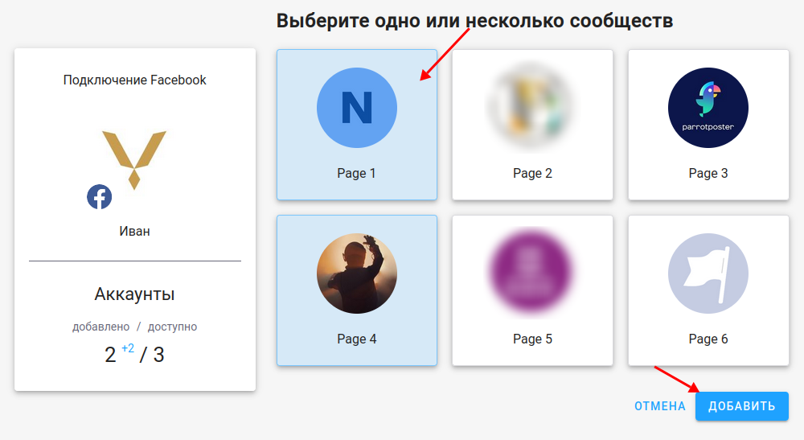

# Подключение Facebook

## Инструкция

Чтобы подключить Facebook, перейдите на страницу добавления соцсетей.
Далее, на вкладке "Facebook" нажмите на кнопку "Перейти к добавлению Facebook".

Facebook попросит вас подтвердить доступ для сервиса ParrotPoster. Нажмите "Продолжить".

Необходимо выбрать пункт предоставить доступ ко всем спискам страниц, чтобы в будущем не было проблем с добавлением новых Страниц.
Затем нажмите "Продолжить".

Facebook покажет вам какие права будет иметь сервис ParrotPoster. Нажмите "Сохранить".

Последним шагом Facebook дает вам ссылку на страницу, где вы в будущем сможете управлять доступами от всех приложений.
Также к этой странице можно получить доступ из настроек профиля.
Нажмите "ОК".

Затем выберите нужные страницы Facebook, которые хотите подключить, и нажмите на "Добавить".

Готово, вы подключили страницу соцсети Facebook!

## Возможные проблемы

::: details Не отображается список групп
В данный момент к ParrotPoster можно подключать только страницы Facebook.
В будущем мы добавим возможность подключать группы.
:::

::: details Нет возможности выбрать профиль
Сервис ParrotPoster не позволяет автоматически публиковать посты в профиль, только в специально созданные для этого страницы и группы.
:::

::: details Отображается пустой список на этапе выбора страниц
Проверьте, являетесь ли вы администратором или модератором нужной страницы.
Если проблема сохраняется, напишите нам на почту [support@parrotposter.com](mailto:support@parrotposter.com)
:::

