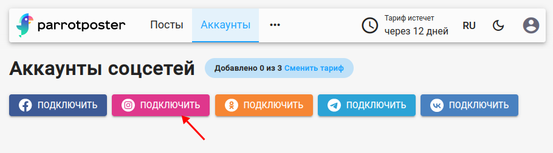
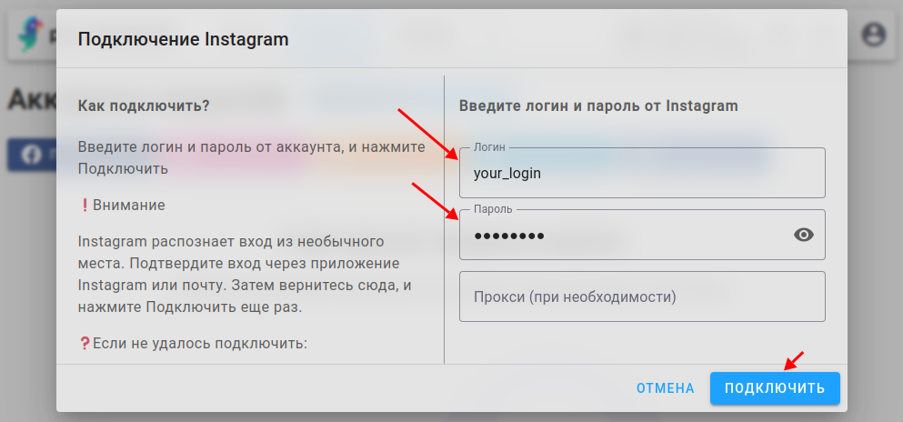

# Подключение Instagram

## Инструкция

Чтобы подключить Instagram, перейдите на страницу добавления соцсетей и нажмите на "Подключить Instagram".

В поля ниже введите ваш логин и пароль от учетной записи Instagram и нажмите на кнопку "Подключить".
Поле Прокси заполнять необязательно, ниже мы объясним нюансы.

::: tip Обратите внимание
Мы не храним ваш пароль в базе данных сервиса ParrotPoster, вместо него мы храним токен сессии.
А пароль необходим только на этапе авторизации.
:::

::: warning Внимание
Instagram может распознать вход из необычного места.
Подтвердите вход через приложение Instagram или почту.
Затем вернитесь сюда, и нажмите "Авторизоваться" еще раз.
:::

<!-- #region proxy-use -->

## Использование прокси

### Почему он нужен?

Мы не используем официальное API Instagram для публикации постов.
Вместо этого мы используем эмуляцию андроид приложения,
и ваш вход в ParrotPoster будет распознан Instagram как вход с обычного устройства. 

Поэтому очень важно, чтобы Instagram доверял устройству и месту, с которого авторизуются.
Когда вы используете Instagram в обычной жизни и авторизуетесь в ParrotPoster,
должен совпадать хотя-бы город, откуда происходят эти действия.

### Почему необязательно заполнять поле Прокси?

Бывает, что инстаграм не станет сильно подозревать вход через ParrotPoster, и вход через наш сервер может пройти достаточно гладко.

### Где расположены серверы ParrotPoster?

Для авторизации и постинга в Instagram, мы используем специальные сервера, 
которые в данный момент расположены в Польше.

### Как использовать свой прокси?

Вы можете купить прокси, который предлагают различные сервисы (можно найти в интернете по словосочетанию "прокси для инстаграм").

Прокси сервис выдаст вам ip адрес следующего вида: `login:password@address:port`.
Где:
- `login:password` - логин и пароль для подключения к выданному прокси
- `address` - адрес в виде `domain.com` или ip адрес вида `127.0.0.1`
- `port` - число в виде `3128`

Прокси сервис может выдать вам все эти данные по отдельности, вам важно их соединить вместе в виде `login:password@address:port` и вписать в поле Прокси.

<!-- #endregion proxy-use -->

## Возможные проблемы

<!-- #region common-errors -->

::: details Возникает ошибка "неверный пароль"
Если вы уверены что вы вводите верный пароль, то попробуйте убрать из него специальные символы.
Например, пароль вида `Tb&*7]+tabqLo` попробуйте преобразовать в `Tb7tabqLo` удалив из него символы `&*]+`, и оставив только буквы и цифры.
:::

::: details Не удается авторизоваться
Попробуйте выполнить следующие действия:
- Подключите (или отключите) двухфакторную аутентификацию. Рекомендуем использовать двухфакторку через специальные приложения, например Google Authenticator (т.к. обычная смс с кодом приходит не всегда).
- Попробуйте повторить попытку авторизации через 1-2 суток, чтобы Instagram "привык" к новому месту входу.
- Попробуйте сменить пароль.
:::

<!-- #endregion common-errors -->
