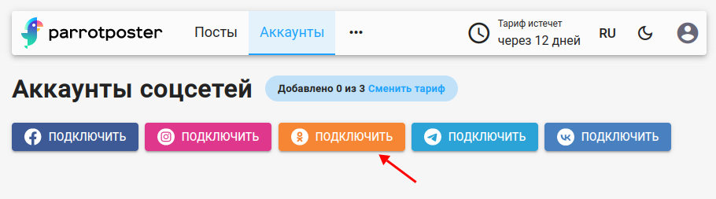
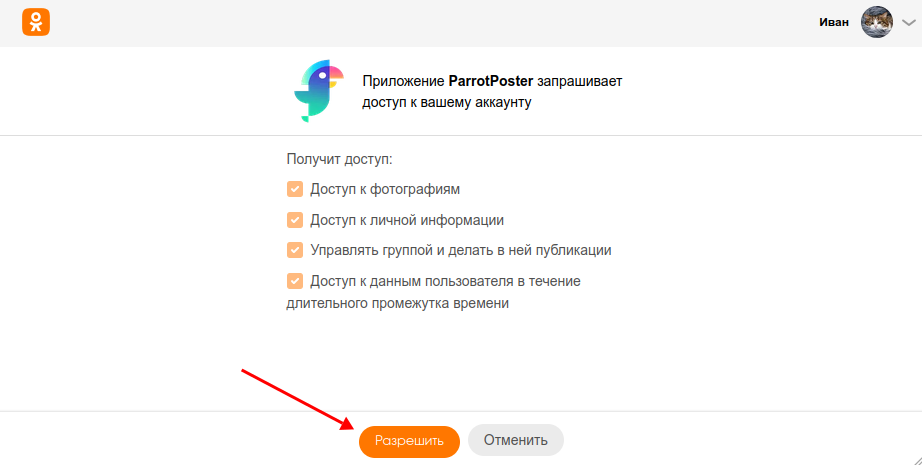
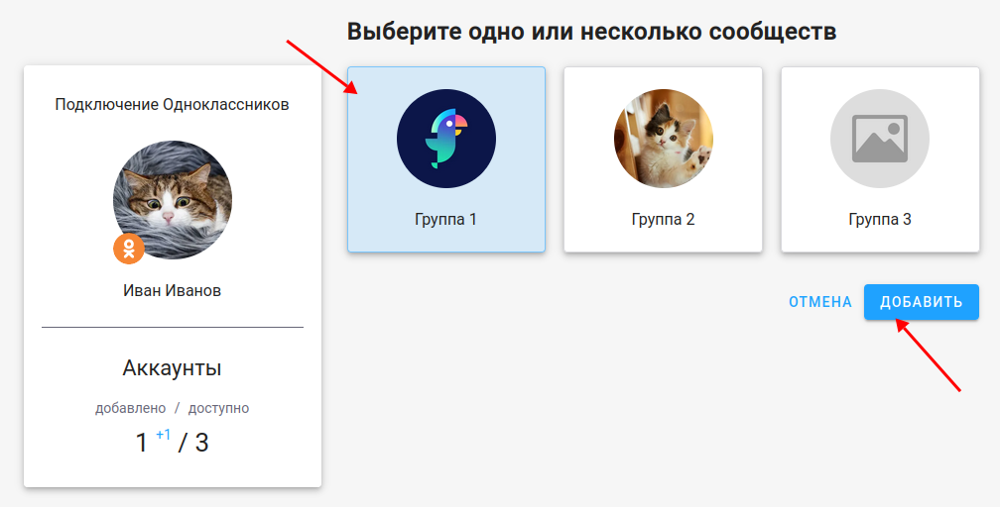

# Подключение Одноклассников

## Инструкция

Чтобы подключить Одноклассники, перейдите на страницу добавления соцсетей.
Далее, на вкладке "Одноклассники" нажмите на кнопку "Перейти к добавлению Одноклассников".

<!-- #region common-auth -->

Одноклассники попросит вас подтвердить доступ для сервиса ParrotPoster. Нажмите "Продолжить".

Затем выберите нужные группы Одноклассников, которые хотите подключить, и нажмите на "Добавить".

Готово, вы подключили страницу соцсети Одноклассники!

<!-- #endregion common-auth -->

## Возможные проблемы

<!-- #region common-errors -->

::: details Нет доступных групп для подключения
Проверьте следующие условия:
- Вы состоите в группе
- Вы имеете права модератор или администратор
:::

<!-- #endregion common-errors -->

