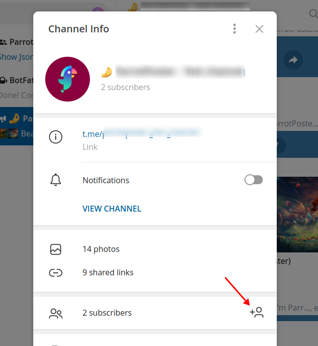

# Подключение Telegram

Для подключения группы или канала Telegram, необходимо сначала создать бота, а затем добавить его в администраторы группы/канала.

Потребуется чуть больше действий, чем с другими соцсетями, но все максимально просто, главное спокойствие!

<!-- #region common-auth -->

## Создание бота

Чтобы создать бота, начните диалог с специальным ботом Telegram: [@BotFather](https://t.me/BotFather).
Этот бот создает других ботов, а также позволяет ими управлять.
Нам нужно создать самый простой бот.

Отправьте боту BotFather сообщение `/start`. Он пришлет вам в ответ список доступных команд. В данный момент знать весь список команд ни к чему, возможно, они вам даже не пригодятся в будущем. Но ради интереса, можете изучить.

Теперь отправьте боту сообщение `/newbot`.
BotFather попросит вас ввести имя для вашего нового бота. Имя может быть любым.

::: tip Обратите внимание
Давайте боту осмысленное название, т.к. оно будет отображаться в качестве автора постов в вашем канале или группе

::: details Подробнее
В канале это будет выглядеть вот так:

А в группе вот так:

:::

Следующим шагом необходимо задать username для бота.
Username должен быть на английском языке, и обязательно должен заканчиваться словом `bot`.
Например, `my_site_bot` или `mySiteBot`.

::: tip Обратите внимание
Username для бота должен быть уникальным в рамках всего Telegram.
Поэтому, если какое-то название уже будет занято - придумайте другое.
:::

Поздравляю, вы создали своего бота!

BotFather выдаст вам токен для созданного бота, скопируйте его (достаточно один раз нажать на него), нам он скоро понадобится.

Теперь необходимо добавить созданного бота в группу или канал. Для того, чтобы сделать это, вы должны являться **администратором** в группе или канале.

## Добавление бота в группу

Перейдите в свою группу, и откройте информацию о ней.
Внизу будет кнопка "Добавить нового участника" - нажмите на нее.

Теперь введите username созданного ранее бота.
В списке должен будет появиться ваш бот.
Выберите его, и нажмите на кнопку "Добавить".

Готово! Вы добавили вашего бота в группу. Теперь можно переходить к следующему шагу.

## Добавление бота в канал

Перейдите в свой канал, и откройте информацию о нем.
Внизу будет кнопка "Добавить нового участника" - нажмите на нее.

Теперь введите username созданного ранее бота.
В списке должен будет появиться ваш бот.
Выберите его, и нажмите на кнопку "Добавить".

В канал бот должен добавляться исключительно в роли администратора, поэтому подтверждаем.

В качестве доступных разрешений можно оставить возможность изменения информации о канале и отправке сообщений

Готово! Вы добавили вашего бота в канал. Теперь можно переходить к следующему шагу.

<!-- #endregion common-auth -->

## Подключение в ParrotPoster

Выполнив предыдущие шаги, перейдите на страницу добавления соцсетей, и нажмите на "Подключить Telegram"

Введите токен бота выданный вам BotFather и ссылку на вашу группу или канал в соответствующие поля.
Затем нажмите на кнопку "Добавить".

Готово, вы подключили аккаунт Телеграм в модуле!

