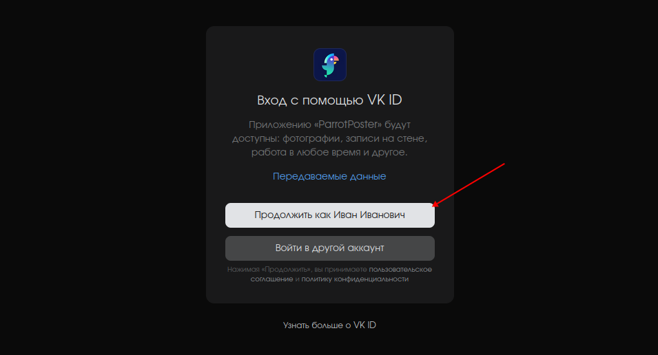

# Подключение ВК

## Инструкция

Чтобы подключить ВК, перейдите на страницу добавления соцсетей.
Далее, нажмите на кнопку "Подключить ВК".

<!-- #region common-auth -->

ВК попросит вас подтвердить доступ для сервиса ParrotPoster. Нажмите "Продолжить".

Затем выберите нужные страницы ВК, которые хотите подключить, и нажмите на "Добавить".

Готово, вы подключили страницу соцсети ВК!

<!-- #endregion common-auth -->

## Возможные проблемы

<!-- #region common-errors -->

::: details Нет доступных страниц для подключения
Проверьте следующие условия:
- Вы состоите в группе/странице (даже если вы являетесь создателем)
- Вы имеете права модератор или администратор
:::

<!-- #endregion common-errors -->
