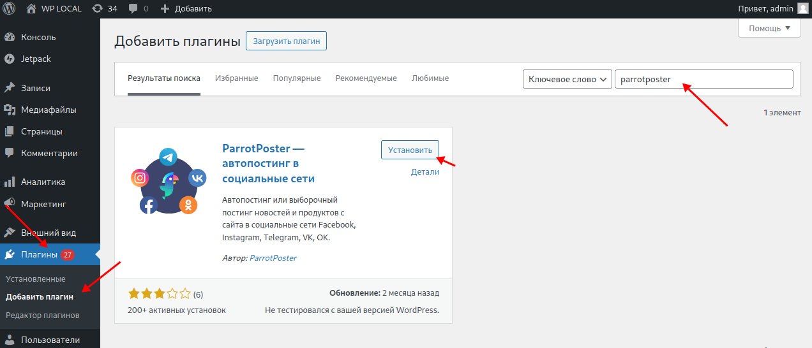
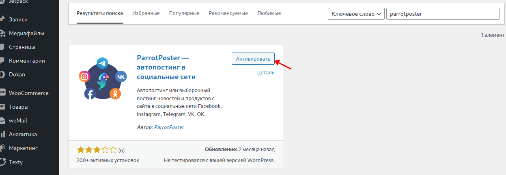
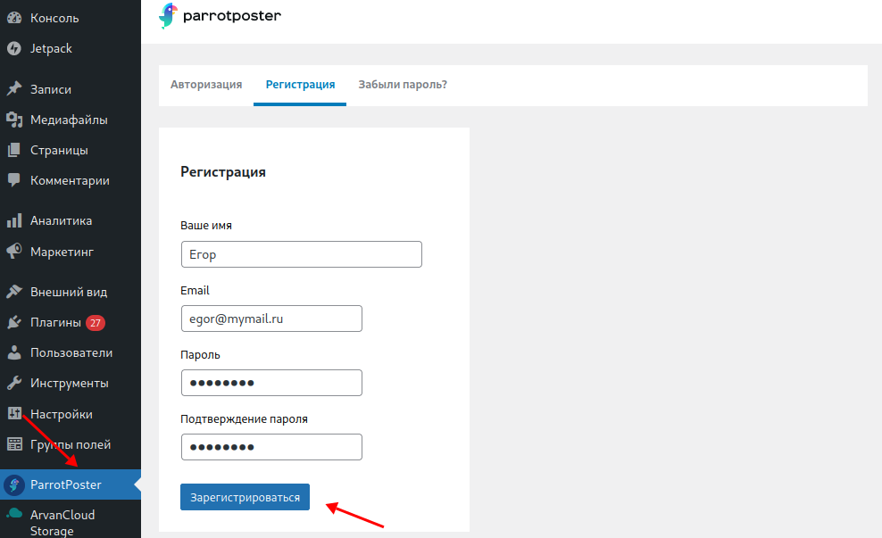
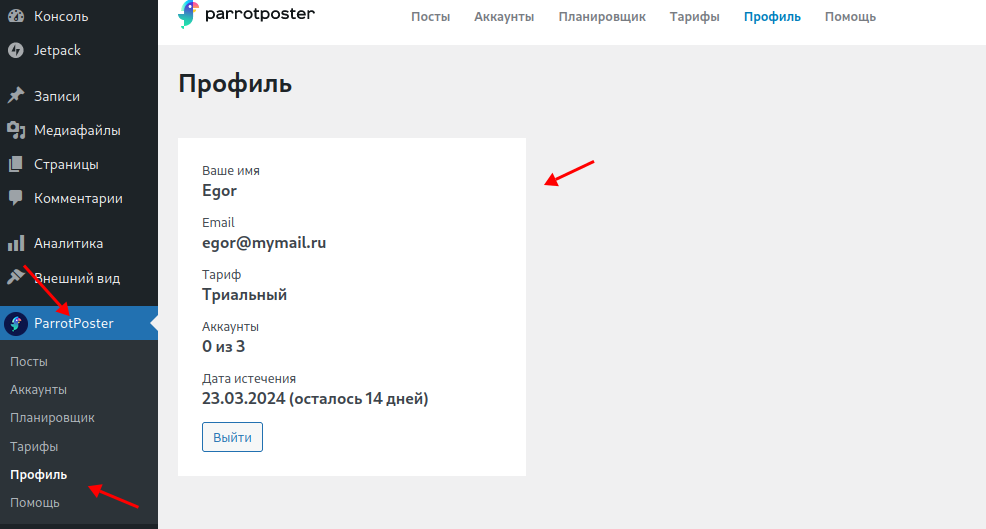
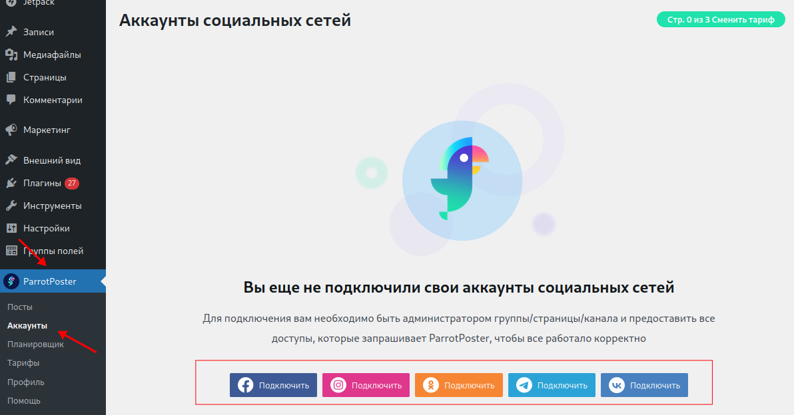

# Плагин ParrotPoster для Wordpress

Плагин позволяет интегрировать сервис автопубликаций ParrotPoster и ваш сайт на CMS Wordpress. Какие преимущества это дает?

- Легко делиться: вы пишите новость на сайте, а плагин автоматически опубликует эту новость во всех соцсетях
- Удобно пользоваться: управление всем процессом публикации происходит через плагин

[Посмотреть плагин на Wordpress](https://wordpress.org/plugins/parrotposter/).

## Установка

Чтобы установить плагин на ваш сайт, перейдите в вашей админке в меню Плагины -> Добавить плагин.
Затем в поле "Поиск плагинов" введите запрос `parrotposter`.
Wordpress выдаст вам результат поиска. На плагине "ParrotPoster - автопостинг в социальные сети" нажмите кнопку "Установить".

После нажмите на кнопку "Активировать".

В меню слева должен появиться пункт ParrotPoster.
Перейдите на него.
У вас откроется окно для Авторизации/Регистрации.
Это необходимо, т.к. плагин работает на основе облачного сервиса [parrotposter](https://parrotposter.com).

После регистрации вам будет доступен 14-дневный триальный период, чтобы вы смогли попробовать плагин в действии.

После успешной регистрации, вы можете посмотреть информацию по вашему текущему профилю в разделе ParrotPoster -> Профиль.

По этому же логин/паролю вы сможете авторизоваться и на сайте [parrotposter](https://parrotposter.com).

Следующим шагом необходимо подключить нужные аккаунты соцсетей.

## Подключение аккаунтов

Для подключение нового аккаунта, перейдите в раздел ParrotPoster -> Аккаунты. 
Вы увидите кнопки с подключением нужной соцсети.

Процесс подключение соцсети максимально упрощен, так что вам необходимо будет нажать на кнопку Подключить, и выбрать нужную группу/страницу соцсети.

Тем не менее, чтобы узнать подробнее про подключение соцсетей, перейдите к интересующей вас странице документации:

- [ВК](./socials/vk/)
- [Telegram](./socials/tg/)
- [Facebook](./socials/fb/)
- [Instagram](./socials/insta/)
- [Одноклассники](./socials/ok/)

