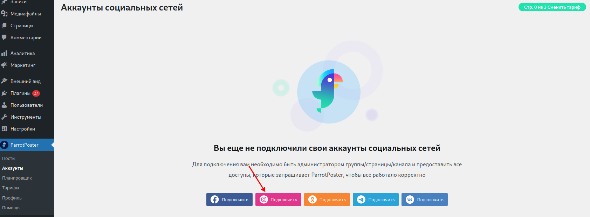
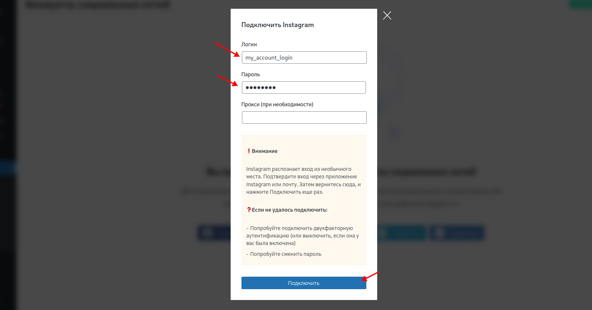

# Подключение Instagram

## Инструкция

Чтобы подключить Instagram, перейдите на страницу добавления соцсетей и нажмите на кнопку Подключить.

В соответствующие поля введите ваш логин и пароль от учетной записи Instagram и нажмите на кнопку "Подключить".
Поле Прокси заполнять необязательно, ниже мы объясним нюансы.

::: tip Обратите внимание
Мы не храним ваш пароль в базе данных сервиса ParrotPoster, вместо него мы храним токен сессии.
А пароль необходим только на этапе авторизации.
:::

::: warning Внимание
Instagram может распознать вход из необычного места.
Подтвердите вход через приложение Instagram или почту.
Затем вернитесь сюда, и нажмите "Подключить" еще раз.
:::

<!-- @include: ../../../socials/insta/index.md#proxy-use -->

## Возможные проблемы

<!-- @include: ../../../socials/insta/index.md#common-errors -->

