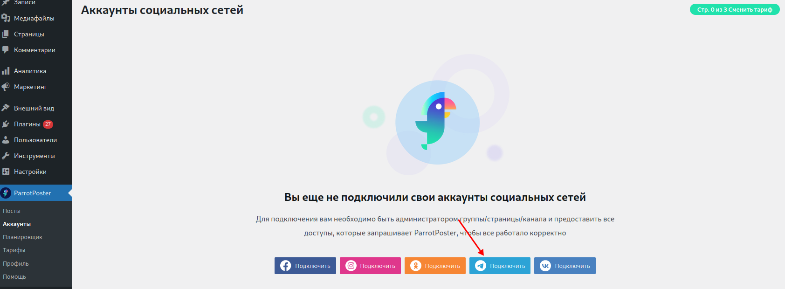
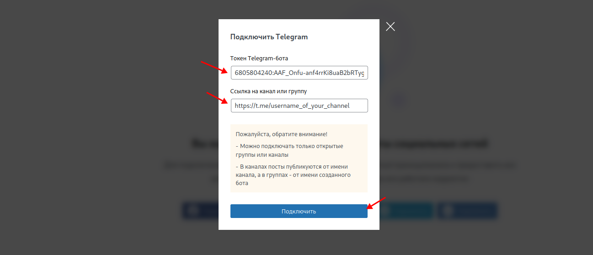

# Подключение Telegram

Для подключения группы или канала Telegram, необходимо сначала создать бота, а затем добавить его в администраторы группы/канала.

Потребуется чуть больше действий, чем с другими соцсетями, но все максимально просто, главное спокойствие!

<!-- @include: ../../../socials/tg/index.md#common-auth -->

## Подключение в плагине

Выполнив предыдущие шаги, зайдите в модуле на страницу подключения соцсетей, и нажмите на кнопку Подключить.

Введите токен бота выданный вам BotFather и ссылку на вашу группу или канал в соответствующие поля.
Затем нажмите на кнопку "Подключить".

Готово, вы подключили аккаунт Телеграм в плагине!

